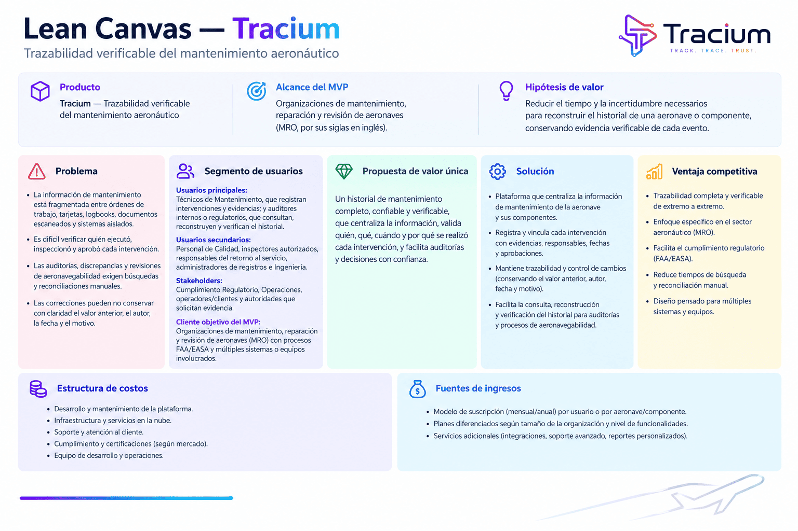
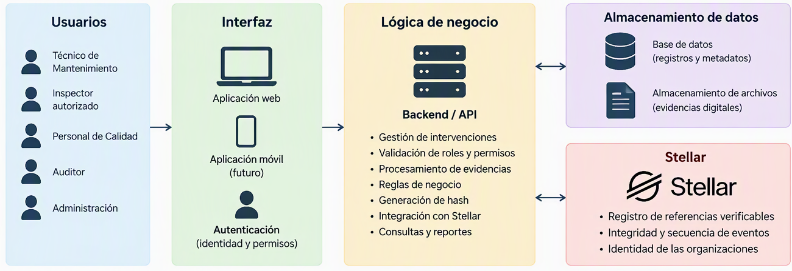

# Product Blueprint

**Nombre del proyecto:** Tracium - Trazabilidad de registros de mantenimiento aeronáutico

**Repositorio (enlace obligatorio):** [tracium_blockchain](https://github.com/darienabdul/tracium_blockchain)

> Los campos marcados como _enlace obligatorio_ deben ir como enlace en Markdown, con este formato: `[texto del enlace](https://...)`. Reemplacen el texto y la dirección de ejemplo.

---

## Contenido

1. Priorización de historias
2. Propuesta de valor
3. Flujo de usuario
4. Alcance del MVP
5. Lean Canvas
6. Backlog priorizado (Kanban)
7. Arquitectura inicial
8. Uso de Stellar y justificación

---

## 1. Priorización de historias

> Historias elegidas entre las que propuso el equipo y criterio con que se priorizaron. Son las que pasan al backlog. Extensión: breve.

## 1. Priorización de historias

> Historias elegidas entre las que propuso el equipo y criterio con que se priorizaron. Son las que pasan al backlog. Extensión: breve.

**Criterio de priorización:** Escriban aquí el criterio (por ejemplo, imprescindible / debería / podría / queda fuera).

Se priorizaron las historias que permiten registrar una intervención desde el origen, consultar su historial completo, comprobar la atribución de las actividades, respaldar el trabajo con evidencia y validar la integridad de los registros:

| Prioridad | Historia                                                                                                                                                                                                                              |        Propuesta por        | Por qué entra al backlog                                                                                                                                                                              |
| :-------: | ------------------------------------------------------------------------------------------------------------------------------------------------------------------------------------------------------------------------------------- | :-------------------------: | ----------------------------------------------------------------------------------------------------------------------------------------------------------------------------------------------------- |
|     1     | Como técnico de mantenimiento, quiero registrar una intervención realizada para que quede asociada a mi identidad, fecha y trabajo ejecutado.                                                                                         |     Abdul Ruiz Saldaña      | Es imprescindible porque crea el registro base del producto. Sin la intervención, su autoría y su fecha, no puede existir un historial trazable ni verificable.                                       |
|     2     | Como personal de Calidad, quiero consultar en un solo lugar el historial completo de una intervención de mantenimiento para verificar quién realizó, inspeccionó y aprobó el trabajo.                                                 | Diego Alejandro Rubio Ramos | Es imprescindible porque representa el resultado principal de la solución: reconstruir y verificar el historial sin reconciliar documentos o sistemas dispersos.                                      |
|     3     | Como auditor, quiero verificar quién realizó cada intervención y cuándo fue registrada para poder comprobar la atribución de las actividades.                                                                                         |     Abdul Ruiz Saldaña      | Es imprescindible para establecer responsabilidad y demostrar la procedencia de cada actividad durante una revisión interna o regulatoria.                                                            |
|     4     | Como inspector autorizado, quiero revisar la evidencia del trabajo y registrar el resultado de mi inspección para confirmar que la intervención cumple con los procedimientos aplicables.                                             | Diego Alejandro Rubio Ramos | Debería entrar porque incorpora la validación formal del trabajo y conecta la intervención con la inspección requerida antes de su aprobación.                                                        |
|     5     | Como auditor, quiero verificar la integridad y secuencia de los registros para poder identificar modificaciones posteriores o inconsistencias en el historial.                                                                        |     Abdul Ruiz Saldaña      | Debería entrar porque permite detectar cambios posteriores y comprobar que el historial mantiene una secuencia confiable.                                                                             |
|     6     | Como personal autorizado para el retorno al servicio, quiero verificar que la ejecución y las inspecciones requeridas estén completas antes de registrar mi aprobación para evitar liberar una aeronave con documentación incompleta. | Diego Alejandro Rubio Ramos | Debería entrar porque completa la cadena de responsabilidad y permite confirmar que el trabajo, la evidencia y las inspecciones requeridas estén disponibles antes de aprobar el retorno al servicio. |

---

## 2. Propuesta de valor

> Qué resultado obtiene el usuario y por qué elegiría esta solución. En qué se diferencia de cómo resuelve hoy. Conecta con el usuario del Problem Brief. Extensión: 150–300 palabras en total.

**Usuario (del Problem Brief):**

El usuario principal es el personal de Calidad que necesita reconstruir o validar el historial de una intervención de mantenimiento aeronáutico. También se benefician los técnicos de Mantenimiento, inspectores autorizados, personal de Ingeniería, Operaciones, auditores y personal de Cumplimiento Regulatorio que producen, revisan, aprueban o consultan los registros.

**Resultado que obtiene:**

El usuario obtiene un historial digital vinculado y verificable de cada intervención. Desde un mismo punto puede consultar quién realizó el trabajo, cuándo se ejecutó, qué evidencia fue adjuntada, quién inspeccionó la actividad, quién aprobó el retorno al servicio y qué modificaciones se realizaron posteriormente. Esto reduce el esfuerzo necesario para reconstruir el historial y facilita la identificación de información incompleta o inconsistente.

**Por qué elegiría esta solución:**

La elegiría porque mejora la trazabilidad, atribución e integridad de los registros sin eliminar los controles de calidad ni las autorizaciones requeridas. Además, facilita la preparación de evidencia para auditorías, investigaciones de discrepancias y revisiones regulatorias. La solución permite validar la procedencia y secuencia de los eventos, manteniendo visibles las correcciones vinculadas al registro original.

**En qué se diferencia de cómo lo resuelve hoy:**

Actualmente, el usuario debe buscar y reconciliar manualmente órdenes de trabajo, tarjetas de tarea, logbooks, formularios firmados, documentos escaneados y datos almacenados en diferentes aplicaciones. La solución propuesta captura y relaciona la evidencia desde el origen mediante identificadores comunes, convirtiendo documentos dispersos en un historial estructurado y verificable, sin asumir que la tecnología por sí sola garantiza que los datos registrados sean correctos.

---

## 3. Flujo de usuario

 

> Recorrido de la persona por la solución de principio a fin, roles y puntos de interacción. Diagrama o secuencia numerada. Extensión: 150–300 palabras.

| Paso | Rol                                             | Qué hace                                                                                                                                                          | Punto de interacción                               |
| :--: | :---------------------------------------------- | ----------------------------------------------------------------------------------------------------------------------------------------------------------------- | -------------------------------------------------- |
|  1   | Técnico de Mantenimiento                        | Inicia sesión, selecciona la aeronave, el componente y la orden de trabajo correspondientes, y registra la intervención realizada.                                | Pantalla de autenticación y formulario de registro |
|  2   | Técnico de Mantenimiento                        | Adjunta la evidencia del trabajo, incluyendo documentos, fotografías o referencias técnicas, y confirma que la información ingresada es correcta.                 | Módulo de evidencias y almacenamiento digital      |
|  3   | Sistema                                         | Asocia la intervención con la identidad del técnico, la fecha, la orden de trabajo y la evidencia adjunta. Después, genera una referencia verificable del evento. | Aplicación, base de datos y red Stellar            |
|  4   | Inspector autorizado                            | Consulta la intervención y su evidencia, verifica el cumplimiento de los procedimientos aplicables y registra el resultado de la inspección.                      | Panel de inspección y billetera digital            |
|  5   | Personal autorizado para el retorno al servicio | Comprueba que el trabajo, la evidencia y las inspecciones requeridas estén completos antes de registrar la aprobación correspondiente.                            | Pantalla de aprobación y red Stellar               |
|  6   | Personal de Calidad                             | Consulta en un solo lugar la secuencia completa de ejecución, inspección, aprobación y posibles correcciones de la intervención.                                  | Panel de historial y trazabilidad                  |
|  7   | Auditor                                         | Revisa quién realizó cada actividad, cuándo fue registrada y si existen modificaciones posteriores o inconsistencias en la secuencia.                             | Vista de auditoría y verificación de registros     |

El flujo comienza con la captura de la intervención y su evidencia desde el origen. Cada evento queda relacionado con la persona responsable, la fecha y la orden de trabajo. Posteriormente, el inspector revisa el trabajo y el personal autorizado valida que la documentación esté completa antes de aprobar el retorno al servicio. Finalmente, Calidad y Auditoría pueden consultar un historial estructurado y verificar la atribución, integridad y secuencia de los registros.

---

## 4. Alcance del MVP

> Funcionalidad central separada de la deseable que queda fuera. Justificación de por qué el recorte sigue entregando valor. Extensión: 150–300 palabras en total.

 
| Dentro del MVP (funcionalidad central) | Fuera del MVP (deseable, para después) |
| -------------------------------------- | -------------------------------------- |
| Registro de una intervención asociada con la identidad del técnico, la aeronave, el componente, la orden de trabajo y la fecha. | Integración automática con sistemas empresariales existentes de mantenimiento, inventario y planificación de recursos. |
| Carga y vinculación de evidencias digitales relacionadas con el trabajo realizado. | Almacenamiento de archivos completos en la red Stellar. En una fase posterior se evaluará el uso de almacenamiento externo con referencias verificables. |
| Revisión de la evidencia y registro del resultado de la inspección por una persona autorizada. | Automatización avanzada de reglas regulatorias, alertas predictivas y recomendaciones basadas en inteligencia artificial. |
| Verificación de que la ejecución y la inspección estén completas antes de registrar la aprobación del retorno al servicio. | Aplicación móvil, funcionamiento sin conexión y sincronización posterior de los registros. |
| Consulta del historial completo de la intervención, incluyendo responsables, fechas, evidencias, inspecciones y aprobación. | Funciones avanzadas de análisis, tableros ejecutivos e indicadores de desempeño. |
| Registro en Stellar de referencias verificables que permitan comprobar la integridad y secuencia de los eventos. | Implementación a escala con múltiples organizaciones, aeronaves y autoridades regulatorias. |

**Por qué el recorte sigue entregando valor:**

El MVP sigue entregando valor porque permite demostrar el flujo principal del producto: registrar una intervención, adjuntar evidencia, inspeccionarla, aprobarla y consultar su historial desde un solo lugar. También permite validar si Stellar puede utilizarse para comprobar la integridad, atribución y secuencia de los eventos, sin almacenar información sensible o archivos completos directamente en la red. Aunque inicialmente no se conecte con todos los sistemas empresariales ni incluya automatización avanzada, el MVP reduce la necesidad de reconciliar manualmente registros dispersos. Además, produce una evidencia verificable del trabajo, la inspección y la aprobación. Este alcance es suficiente para probar la propuesta de valor con técnicos, inspectores, personal de Calidad y auditores antes de invertir en integraciones, escalabilidad y funciones complementarias.

---

## 5. Lean Canvas

> Lienzo de una página con el modelo del producto. Extensión: enlace (obligatorio).

**Enlace al Lean Canvas (obligatorio):** [Lean Canvas del proyecto](./images/tracium-lean-canvas-infographic.png)

El lienzo debe cubrir: problema, segmento de usuarios, propuesta de valor única, solución, canales, métricas clave, ventaja diferencial y estructura de costos e ingresos.

---

## 6. Backlog priorizado (Kanban)

> Enlace al tablero en GitHub Projects, construido con las historias priorizadas, en columnas y con criterios de aceptación por tarjeta. Extensión: enlace al tablero (obligatorio).

**Enlace al tablero (obligatorio):** [Tablero Kanban en GitHub Projects](https://github.com/users/darienabdul/projects/6)

---

## 7. Arquitectura inicial

> Cómo se conectan las partes (interfaz, lógica, Stellar) y en qué punto entra la red. Diagrama simple en imagen. Extensión: 150–300 palabras en total.

**Diagrama:**

 
| Capa | Componente | Qué hace |
| :---: | ---------- | -------- |
| Usuarios | Técnicos de Mantenimiento, inspectores autorizados, personal de Calidad, auditores y administradores | Registran, revisan, aprueban, consultan y administran las intervenciones de mantenimiento según su rol y permisos. |
| Interfaz | Aplicación web, autenticación y aplicación móvil futura | Permite registrar intervenciones, adjuntar evidencias, documentar inspecciones, aprobar el retorno al servicio y consultar el historial. La autenticación controla la identidad y los permisos de acceso. |
| Lógica | Backend y API | Gestiona las intervenciones, valida los roles y permisos, procesa las evidencias, aplica las reglas de negocio, genera los hashes y conecta la aplicación con Stellar. |
| Almacenamiento | Base de datos y almacenamiento de archivos | Conserva los registros, metadatos y archivos de evidencia digital fuera de la red Stellar. |
| Stellar | Red Stellar, Stellar SDK y Horizon API | Registra referencias verificables, permite comprobar la integridad y secuencia de los eventos y representa la identidad de las organizaciones participantes. |

**En qué punto entra la red:**

La red Stellar entra cuando la lógica de negocio genera una referencia verificable, o hash, de una intervención, inspección, aprobación o corrección. Después de validar la identidad, los permisos y la información del evento, el backend utiliza el Stellar SDK para enviar a la red la referencia verificable y los metadatos mínimos necesarios.

Los detalles de las intervenciones, los registros operativos y los archivos de evidencia se almacenan fuera de la red, en la base de datos y en el almacenamiento de archivos. De esta manera, Stellar no almacena directamente información técnica o sensible. Cuando Calidad o Auditoría consulta el historial, el backend recupera la información almacenada y compara su hash con la referencia registrada en Stellar. Si los valores coinciden, el sistema puede comprobar que el registro no ha sido modificado. Stellar también permite mantener una secuencia verificable de los eventos clave e identificar a las organizaciones que participan en el proceso.

---

## 8. Uso de Stellar y justificación

 

> Qué componentes de Stellar usaría y por qué cada uno. Apoyado en el criterio de pertinencia del Problem Brief. Extensión: 150–300 palabras en total.

**Criterio de pertinencia (del Problem Brief):**

El proyecto se apoya en el criterio de que varias organizaciones independientes, como operadores, organizaciones de mantenimiento y centros de servicio, necesitan compartir y validar un mismo historial sin depender exclusivamente de un custodio central. También requiere conservar la secuencia de las intervenciones, inspecciones, aprobaciones y correcciones para identificar modificaciones posteriores. Stellar solo será pertinente si demuestra ventajas concretas frente a una base de datos centralizada con firmas electrónicas, control de acceso, versionado y auditoría.

 
| Componente de Stellar | Para qué lo usamos | Por qué ese y no otra alternativa |
| --------------------- | ------------------- | --------------------------------- |
| Cuentas y firmas de Stellar | Representar a las organizaciones participantes y autorizar el registro de eventos según su identidad y responsabilidad. | Permiten comprobar qué cuenta autorizó una transacción sin depender únicamente de credenciales administradas por una sola organización. |
| Transacciones de Stellar | Registrar el hash, identificador y metadatos mínimos de cada intervención, inspección, aprobación o corrección. | Proporcionan una secuencia verificable y compartida. Los detalles y archivos permanecen fuera de la red para evitar publicar información sensible. |
| Stellar SDK y RPC | Conectar el backend con la red, construir y enviar transacciones, y consultar sus resultados. | Evitan implementar directamente la comunicación con los nodos y simplifican la integración técnica de la aplicación. |
| Contratos inteligentes de Stellar | Aplicar reglas para registrar eventos, validar autorizaciones y relacionar correcciones con registros anteriores. | Permiten que las reglas compartidas se ejecuten de forma consistente, en lugar de depender completamente de la lógica interna de un solo participante. |
| Stellar Testnet | Probar el flujo del MVP sin utilizar la red principal ni asumir costos o riesgos operativos reales. | Permite validar la integración y corregir errores antes de considerar una implementación productiva. |
